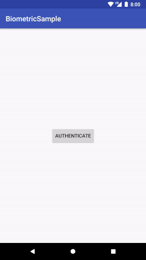
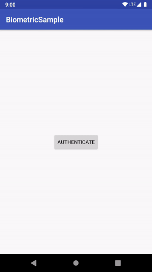

# BiometricAuth

[  ](https://bintray.com/tailoredmedia/maven/biometricauth/_latestVersion)

This library brings the new Android P BiometricPrompt for fingerprint authentication backported to Android SDK 23 with RxJava2 (and Kotlin).


Dialog shown on Android 23 (Marshmallow) to Android 27 (Oreo) devices on the left,
Android Pie dialog shown on the right:

        


## Setup

To use this library your `minSdkVersion` must be >= 15. (Note that the dialog however will only show starting Android SDK 23).

```gradle
allprojects {
    repositories {
        ...
        jcenter()
    }
}

dependencies {
    implementation 'com.tailoredapps.biometricauth:biometricauth:1.0.0'
}
```


## Usage


Create a `BiometricAuth` instance:

```kotlin
val biometricAuth = BiometricAuth.create(this); // where this is an (AppCompat-)Activity
```

```kotlin
if(!biometricAuth.hasFingerprintHardware) {
    //The devices does not support fingerprint authentication (i.e. has fingerprint no hardware):
    Toast.makeText(this, "Device does not support fingerprint", Toast.LENGTH_SHORT).show()
} else if(!biometricAuth.hasFingerprintsEnrolled) {
    //The user has not enrolled any fingerprints (i.e. fingerprint authentication is not activated by the user)
    Toast.makeText(this, "User has not enrolled any fingerprints", Toast.LENGTH_SHORT).show()
} else {
    biometricAuth
        .authenticate(
                title = "Please authenticate",
                subtitle = "'Awesome Feature' requires your authentication",
                description = "'Awesome Feature' exposes data private to you, which is why you need to authenticate.",
                negativeButtonText = "Cancel",
                prompt = "Touch the fingerprint sensor",
                notRecognizedErrorText = "Not recognized"
        )
        .subscribe(
                { Log.d("BiometricAuth", "User authentication successful.") },
                { throwable ->
                    if(throwable is BiometricAuthenticationCancelledException) {
                        Log.d("BiometricAuth", "User cancelled the operation")
                    } else if(throwable is BiometricAuthenticationException) {
                        Log.d("BiometricAuth", "Unrecoverable authentication error")
                    } else {
                        Log.d("BiometricAuth", "Error during user authentication.", it)
                    }
                }
        )
}
```

The `authenticate()` function returns a [Completable](http://reactivex.io/RxJava/javadoc/io/reactivex/Completable.html), which either:

* completes, which indicates an authentication success, or
* emits an error:
  * `BiometricAuthenticationCancelledException`, which signals that the operation has cancelled (most likely triggered by the user).
  * `BiometricAuthenticationException`, which signals an unrecoverable error during biometric authentication (e.g. too many invalid attempts).
  * any other _unexpected_ error during authentication. (Not any of the *internal* fingerprint errors like "not detected", as they will be handled internally), or


## What's inside?

On Android P (SDK 28) devices, the new [BiometricPrompt](https://developer.android.com/reference/android/hardware/biometrics/BiometricPrompt) API is used.

On Devices running Android Marshmallow to Oreo (SDK 23..28), the [FingerprintManagerCompat](https://developer.android.com/reference/android/support/v4/hardware/fingerprint/FingerprintManagerCompat) API is used in combination with a custom UI, which imitates the AndroidP BiometricPrompt Bottom-Sheet.

On older devices, where Fingerprint Authentication is not supported by native Android SDKs, calling `hasFingerprintHardware` or `hasFingerprintsEnrolled` will always return false.


# License

```
Copyright 2018 Tailored Media GmbH

Licensed under the Apache License, Version 2.0 (the "License");
you may not use this file except in compliance with the License.
You may obtain a copy of the License at

    http://www.apache.org/licenses/LICENSE-2.0

Unless required by applicable law or agreed to in writing, software
distributed under the License is distributed on an "AS IS" BASIS,
WITHOUT WARRANTIES OR CONDITIONS OF ANY KIND, either express or implied.
See the License for the specific language governing permissions and
limitations under the License.
```